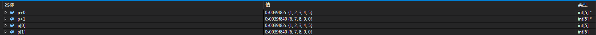

# 指针与数组

## 指针与数组的关系
1. 数组名 arr 本身就是一个指针，它指向数组的第一个元素
```c
int arr[5] = { 1,2,3 };
```
数组 arr 的首地址是 0x0046f958:
|
|0x0046f959|0x0046f958 + 1|00||
|0x0046f95A|0x0046f958 + 2|00||
|0x0046f95B|0x0046f958 + 3|00||
|0x0046f95C|0x0046f958 + 4|02||

- 从首地址开始，每次偏移 4 个字节

|地址|地址偏移|值|内存|
|--|--|--|--|
|0x0046f958|0x0046f958 + 0 * 4|01||
|0x0046f95C|0x0046f958 + 1 * 4|02||
|0x0046F960|0x0046f958 + 2 * 4|03||
|0x0046f964|0x0046f958 + 3 * 4|00||
|0x0046f968|0x0046f958 + 4 * 4|00||

- 地址偏移的等价计算

|地址偏移|地址偏移的等价计算|起始地址|值|
|--|--|--|--|
|arr + 0|arr + 0 * sizeof(int)|0x0046f958|1|
|arr + 1|arr + 1 * sizeof(int)|0x0046f95C|2|
|arr + 2|arr + 2 * sizeof(int)|0x0046F960|3|
|arr + 3|arr + 3 * sizeof(int)|0x0046f964|0|
|arr + 4|arr + 4 * sizeof(int)|0x0046f968|0|

2. 因为 arr 本身是指针，所以可以直接赋值给同类型的指针， p = arr 等价于 p = &arr[0]
```c
#include <stdio.h>

int main() {
	int arr[5] = { 1,2,3 };
	int* p;
	//p = &arr[0];
	p = arr;
	printf_s("%8s = %8d, %8s = %8d, %8s = %8d\n", "*p", *p, "arr[0]", arr[0], "*arr", *arr);
	printf_s("%8s = %p, %8s = %p, %8s = %p\n", "p", p, "arr", arr, "&arr[0]", &arr[0]);

	system("pause");
	return 0;
}
```

```
      *p =        1,   arr[0] =        1,     *arr =        1
       p = 0046f958,      arr = 0046f958,  &arr[0] = 0046f958
```

3. 指针和数组名在效果上是等价的。但是，指针变量可以参与表达式的计算，如 p++ 和 p = arr 是有效的，而数组名不可以参与表达式的计算，如 arr = p 和 a++ 是无效的。
```c
#include <stdio.h>

int main() {
	int arr[5] = { 1,2,3 };
	int* p = arr;
	printf_s("*p = %d\n", *p);
	p++;
	printf_s("*p = %d\n", *p);

	system("pause");
	return 0;
}
```

```
*p = 1
*p = 2
```

4. 数组的各元素在内存中是连续的，可以通过索引下标的方式 arr[i] 获取任意一个元素，而 arr[i+1] 一定代表下一个元素（除非数组索引越界），arr[i-1] 一定代表前一个元素（除非数组索引越界）
```c
#include <stdio.h>

int main() {
	int arr[5] = { 1,2,3 };
	for (int i = 0; i < sizeof(arr) / sizeof(int); i++) {
		printf_s("%d\t", arr[i]);
	}
	printf_s("\n");

	system("pause");
	return 0;
}
```

```
1       2       3       0       0
```

5. 因为数组名也是指针，所以也可以将获取元素的方式写成 *(arr)，它等价于 arr[0] ，即代表第一个元素的值。同理，*(arr+1) 等价于 arr[1] 即表示第二个元素，*(arr+i) 等价于 arr[i] 即表示第 i+1 个元素
```c
printf_s("%d\t", *(arr + i));
```

6. 也可以直接通过指针的加减法运算取得对应位置的元素地址。
```c
#include <stdio.h>

int main() {
	int arr[5] = { 1,2,3 };
	for (int *p = arr; p < arr + sizeof(arr) / sizeof(int); p++) {
		printf_s("%d\t", *p);
	}
	printf_s("\n");

	system("pause");
	return 0;
}
```

```
1       2       3       0       0
```

7. 实际上，数组索引下标运算就是先取指针，再通过指针去取得对应元素。所以，使用指针的效率比使用索引下标取数组值的效率要高

8. 指针和数组之间的等价方式

|等价方式|描述|
|--|--|
|&arr[i]; arr + i; p + i;|都表示 inde x= i 元素的地址|
|arr[i]; *(arr + i); *(p + i);|都表示 index = i 元素的值|

## 指针运算
```c
#include <stdio.h>

int main() {
	int arr[10] = { 95,100,3,10,25,20,60,90,55,1 };
	int *p = arr;

	printf_s("%d\n", *p); // 取数组的第 1 个元素

	// p += 1
	p++; // 指针后移 1 位，即指向第 2 个元素的地址
	printf_s("%d\n", *p); // 取数组的第 2 个元素

	// 一元运算符 * 和 ++ 的优先级相同，它们从右向左运算
	printf_s("%d\n", *++p); // 指针先后移 1 位，再取数组的第 3 个元素

	printf_s("%d\n", *p); // 取数组的第 3 个元素

	printf_s("%d\n", *p++); // 取数组的第 3 个元素，但是指针已经指向第 4 个元素的地址了

	printf_s("%d\n", *p); // 取数组的第 4 个元素

	int* p1 = &arr[1];
	int* p2 = &arr[6];

	printf_s("p2 - p1 = %d\n", p2 - p1); // 计算两个指针之间的元素个数

	system("pause");
	return 0;
}
```

```
95
100
3
3
3
10
p2 - p1 = 5
```

## 指针数组
**指针数组是一个数组，数组中的每一个元素都是指针。**

声明一个指针数组的方法如下：

```c
int* p[10];    // 声明一个指针数组，该数组有10个元素，其中每个元素都是一个指向int类型的指针
```

在上述声明中，由于 [] 的优先级比 * 高，故 p 先与 [] 结合，成为一个数组 p[]；再由 int* 指明这是一个 int 类型的指针数组，数组中的每个元素都是指向 int 类型的指针。

```c
#include <stdio.h>

int main() {
	int arr[10] = { 95,100,3,10,25,20,60,90,55,1 };
	int len = sizeof(arr) / sizeof(int);

	for (int i = 0; i < len; i++) {
		printf_s("&arr[%d] = %p\n", i, &arr[i]);
	}

	int* p[10];
	// 把 int 类型数组 arr 的每个元素的地址依次赋值给指针数组 p 的每个元素
	for (int i = len - 1; i >= 0; i--) {
		p[len - 1 - i] = arr + i;
	}
	for (int i = 0; i < len; i++) {
		printf_s("p[%d] = %p, *p[%d] = %d\n", i, p[i], i, *p[i]);
	}

	system("pause");
	return 0;
}
```

```
&arr[0] = 0043FCF0
&arr[1] = 0043FCF4
&arr[2] = 0043FCF8
&arr[3] = 0043FCFC
&arr[4] = 0043FD00
&arr[5] = 0043FD04
&arr[6] = 0043FD08
&arr[7] = 0043FD0C
&arr[8] = 0043FD10
&arr[9] = 0043FD14
p[0] = 0043FD14, *p[0] = 1
p[1] = 0043FD10, *p[1] = 55
p[2] = 0043FD0C, *p[2] = 90
p[3] = 0043FD08, *p[3] = 60
p[4] = 0043FD04, *p[4] = 20
p[5] = 0043FD00, *p[5] = 25
p[6] = 0043FCFC, *p[6] = 10
p[7] = 0043FCF8, *p[7] = 3
p[8] = 0043FCF4, *p[8] = 100
p[9] = 0043FCF0, *p[9] = 95
```

## 数组指针
### 二维数组
```c
int arr[2][5] = { 1,2,3,4,5,6,7,8,9,0 };
int(*p)[5] = arr;
```

arr[2][5] 可以看作是由 2 个一维数组(长度是 5)所组成的二维数组。**不管是一维数组还是多维数组，在内存里都是线性存储的。**

逻辑存储的视图:

||列1|列2|列3|列4|列5|
|--|--|--|--|--|--|
|行1|arr[0][0]|arr[0][1]|arr[0][2]|arr[0][3]|arr[0][4]|
|行2|arr[1][0]|arr[1][1]|arr[1][2]|arr[1][3]|arr[1][4]|

物理存储的视图:

||列1|列2|列3|列4|列5|列6|列7|列8|列9|列10|
|--|--|--|--|--|--|
|行|arr[0][0]|arr[0][1]|arr[0][2]|arr[0][3]|arr[0][4]|arr[1][0]|arr[1][1]|arr[1][2]|arr[1][3]|arr[1][4]|

二维数组详解:
- arr 与 \*arr
   - arr 表示一个二维数组，类型是 int[2][5]，值是二维数组的第 1 个元素的地址
   - \*arr 表示一个一维数组，是二维数组的第 1 行，类型是 int[5]，值是一维数组的第 1 个元素的地址
   
   - arr 的成员是两个一维数组，类型是int[5]；\*arr 的成员是 5 个整型数值，类型是 int
   

- 行地址偏移 + 0
   - arr + 0 表示一个数组指针，指向二维数组的第 1 行，类型是 int[5] \*，值是第 1 个元素的地址
   - \*(arr + 0) 表示一个一维数组，是二维数组的第 1 行，类型是 int[5]，值是第 1 个元素的地址
   - \*(arr + 0) + 0 表示二维数组的第 1 行的第 1 个元素的地址，类型是 int \*
   - \*(\*(arr + 0) + 0) 表示二维数组的第 1 行的第 1 个元素的值，类型是 int
   - \*arr + 0 表示二维数组的第 1 行的第 1 个元素的地址，类型是 int \*
   - \*(\*arr + 0) 表示二维数组的第 1 行的第 1 个元素的值，类型是 int
   
   - 详细说明
   

- 行地址偏移 + 1
   - arr + 1 表示一个数组指针，指向二维数组的第 2 行，类型是 int[5] \*，值是第 1 个元素的地址
   - \*(arr + 1) 表示一个一维数组，是二维数组的第 2 行，类型是 int[5]，值是第 1 个元素的地址
   - \*(arr + 1) + 1 表示二维数组的第 2 行的第 2 个元素的地址，类型是 int \*
   - \*(\*(arr + 1) + 1) 表示二维数组的第 2 行的第 2 个元素的值，类型是 int
   - \*arr + 1 表示二维数组的第 1 行的第 2 个元素的地址，类型是 int \*
   - \*(\*arr + 1) 表示二维数组的第 1 行的第 2 个元素的值，类型是 int
   
   - 详细说明
   

- &arr 与地址偏移
   - &arr 表示一个二维数组，类型是 int[2][5]，值是二维数组的第 1 个元素的地址
   - &arr + 0 表示一个二维数组，类型是 int[2][5]，值是二维数组的第 1 个元素的地址
   - &arr + 1 表示一个二维数组，类型是 int[2][5]，值是 arr 偏移 40 个字节(2 * 5 * sizeof(int))之后所指向的二维数组的第 1 个元素的地址
   
   - 详细说明
   

- p 与 \*p
   - p 表示一个数组指针，指向二维数组的第 1 行，类型是 int[5] \*，值是第 1 个元素的地址
   - \*p 表示一个一维数组，是二维数组的第 1 行，类型是 int[5]，值是第 1 个元素的地址
   - \*\*p 表示二维数组的第 1 行的第 1 个元素的值，类型是 int
   

- 行指针偏移
   - p + 0 表示一个数组指针，指向二维数组的第 1 行，类型是 int[5] \*，值是第 1 个元素的地址
   - p + 1 表示一个数组指针，指向二维数组的第 2 行，类型是 int[5] \*，值是第 1 个元素的地址
   - p[0] 表示一个一维数组，是二维数组的第 1 行，类型是 int[5]，值是第 1 个元素的地址
   - p[1] 表示一个一维数组，是二维数组的第 2 行，类型是 int[5]，值是第 1 个元素的地址
   

- 行指针的解引用
   - \*(p + 0) 表示二维数组的第 1 行，是一个一维数组，类型是 int[5]，值是第 1 个元素的地址
   - \*(p + 1) 表示二维数组的第 2 行，是一个一维数组，类型是 int[5]，值是第 1 个元素的地址
   - \*(\*(p + 0)) 表示二维数组的第 1 行的第 1 个元素的值，类型是 int
   - \*(\*(p + 1)) 表示二维数组的第 2 行的第 1 个元素的值，类型是 int
   - \*(\*p + 0) 表示二维数组的第 1 行的第 1 个元素的值，类型是 int
   - \*(\*p + 1) 表示二维数组的第 2 行的第 1 个元素的值，类型是 int
   
   - 详细说明
   

- 通过 **行地址 + 偏移量** 来访问数组 arr[2][5] 里的每个元素的地址
```c
for (int i = 0; i < 2; i++) {
	for (int j = 0; j < 5; j++) {
		printf_s("%p\t", *(arr + i) + j);
	}
	printf_s("\n");
}
```

- 通过 **数组下标** 来访问数组 arr[2][5] 里的每个元素的值
```c
for (int i = 0; i < 2; i++) {
	for (int j = 0; j < 5; j++) {
		printf_s("%d\t", arr[i][j]);
	}
	printf_s("\n");
}
```

- 通过 **行指针 + 偏移量** 来访问数组 arr[2][5] 里的每个元素的地址
```c
for (int i = 0; i < 2; i++, p++) {
	for (int j = 0; j < 5; j++) {
		printf_s("%p\t", *p + j);
	}
	printf_s("\n");
}
```

- 通过 **行指针 + 偏移量** 来访问数组 arr[2][5] 里的每个元素的值
```c
for (int i = 0; i < 2; i++, p++) {
	for (int j = 0; j < 5; j++) {
		printf_s("%d\t", (*p)[j]);
	}
	printf_s("\n");
}
```

### 数组指针
**数组指针是一个指针，它指向一个数组。**

声明一个数组指针的方法如下：

```c
int (*p)[10];        // 声明一个数组指针 p ，该指针指向一个含有 10 个元素的一维数组
```

p 是一个指向 int 类型的一维数组的指针，这个一维数组的长度是 10，这也是指针 p 的步长。也就是说，**当执行 p + 1 时，p 要跨过 n 个 int 型数据的长度，此时 p 指向下一行一维数组的首地址。** 

```c
#include <stdio.h>

int main() {
	int arr[2][5] = { 1,2,3,4,5,6,7,8,9,0 };
	int(*p)[5] = arr; // 定义一个数组指针，指针指向一个含有 5 个元素的一维数组

	p = arr; // 将二维数组的首地址赋值给 p，此时 p 指向二维数组的第一行的首地址，即 &arr[0][0]
	for (int i = 0; i < 5; i++) {
		printf_s("%d\t", (*p)[i]);
	}
	printf_s("\n");

	p++; // 对 p 进行算术运算，此时 p 指向二维数组的第二行的首地址，即 &arr[1][0]
	for (int i = 0; i < 5; i++) {
		printf_s("%d\t", *(*p + i));
	}
	printf_s("\n");

	system("pause");
	return 0;
}
```

```
1       2       3       4       5
6       7       8       9       0
```
